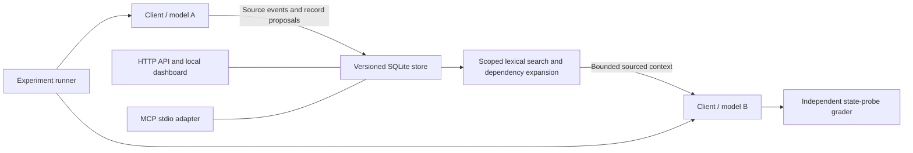

# Architecture and boundaries

The model-independent interface is a JSON record schema. It transfers facts and task state, not
internal activations, KV caches, or hidden reasoning. Plain records, structured records and raw
events remain inspectable. No model is required for manual API/MCP writes or reads.

## Storage and write semantics

Each namespace has an integer revision. Writes run in `BEGIN IMMEDIATE` transactions and require
the expected revision. Duplicate IDs, missing source IDs, unknown links, self-links and cycles
reject the entire batch. Original event/record bodies are immutable. A replacement appends a new
record whose `supersedes` list references older records. Conflicting replacement branches remain
visible; this prototype does not automatically decide which branch is true.

Supersession and record status are model-proposed interpretations. Checking that a cited event
exists does not prove the interpretation is supported. The store does not turn an assistant claim
into a verified tool observation. `applies_to` preserves artifact scope; automatic validation of
real artifact dependencies is a future policy, not a guarantee in v0.1.

## Retrieval

FTS5 finds candidates within a namespace. Deterministic distinct-query-word overlap ranks them;
ties use newest record sequence, then record ID. Ranking does not depend on records in other
namespaces. Unmatched records may fill remaining capacity in newest-first order.

Plain rendering returns ID, kind and compact text. Structured rendering excludes superseded
top-level records and includes dependency closure, source event bodies, statuses and version
fields. Historical dependencies can still appear, explicitly labeled superseded. Each candidate
and its dependencies is admitted as a whole unit only if it fits the UTF-8 byte ceiling. The
response includes omitted count and selected IDs. Large source events can make a useful record
too expensive to include; this is an observable failure mode rather than hidden truncation.

There are no embeddings or graph database dependencies in this slice. Relationship links are
stored in JSON. Their representation can later be compared with graph/vector retrieval without
changing the external interface.

## Integration and local deployment

HTTP and MCP share the same database if launched with the same data directory. The MCP adapter
uses the pinned Python SDK 1.26 stdio implementation; it is not a claim of support for every future
MCP revision. An actual SDK client/server round trip is in the offline checks.

The dashboard is packaged static HTML/CSS/JavaScript; it needs no Node server or remote assets.
Only one dashboard experiment can run at a time. Direct CLI users must avoid running additional
evaluations concurrently if they want interpretable timing. Reader calls are sequential with a
seeded randomized condition order. Writer/reader model changes can require loading weights; both
wall time and reported load/inference time are recorded.

The HTTP server binds to 127.0.0.1:8765. Trusted host and same-origin checks protect the local
interface from ordinary cross-origin browser requests. There is no multiuser auth, internet
deployment, or arbitrary command endpoint. Namespace separation is logical, not a security
boundary. Retrieved records must be treated as untrusted data by integrating hosts. All local
records/runs live in ignored `.local/`; export only reviewed synthetic results.
